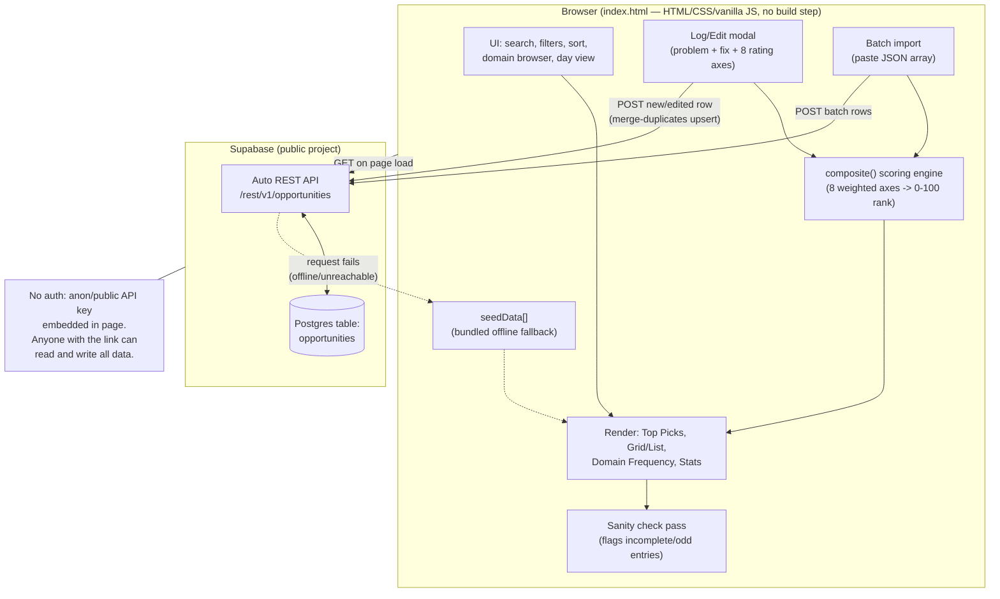

Signal Desk — Opportunity Engine

A single-page, shared web app for logging, scoring, and ranking business/product opportunity ideas across domains (AI, Healthcare, Education, Finance, Climate, and more). Anyone with the link reads from and writes to the same live database, so a team (or a solo founder collecting research from multiple sources) can build a running, ranked backlog of ideas worth pursuing.

Live at: index.html (open directly, or host as a static page — no build step required)

What it does

Every entry captures a potential opportunity as a structured brief: the problem in plain English, why it happens, who faces it, how often it comes up, a technical fix, a non-technical fix, the skills needed, a suggested MVP, and a case for (or against) pursuing it. Each entry is also scored across eight weighted axes — market demand, recurrence, low competition, business potential, AI potential, ease to build, launch speed, and solo-founder fit — which roll up into a single 0-100 composite rank. The app surfaces the top three ranked opportunities, lets you browse or search by domain, filter by status (New, Watching, Pursuing, Archived), sort by rank/AI potential/recency, batch-import new ideas as JSON, and run a "sanity check" pass over the data.

Architecture

This is a single static HTML file (index.html) with all CSS and JavaScript inlined — no build tooling, no framework, no server code. Persistence is handled by a public Supabase project acting as a lightweight REST-backed database:

- On load, the page fetches all rows from a Supabase `opportunities` table via its auto-generated REST API.
- New or edited opportunities are POSTed back to the same table (upserted via `resolution=merge-duplicates`).
- If the Supabase call fails (offline, database unreachable), the app falls back to a bundled set of seed opportunities so the page still works standalone.
- There is no authentication: the Supabase key embedded in the page is a public/anon key, and anyone with the link can add or edit entries. This is by design for easy sharing, but it means the data is not private and not access-controlled.

Because everything lives in one HTML file, deployment is just serving that file (GitHub Pages, Netlify drop, or opening it locally).

Architecture diagram

Data model

Each opportunity row includes:
- Problem: domain, title, plain-English explanation, root cause, who's affected, frequency
- Fix: technical solution, non-technical solution, skills required, MVP scope, reasoning for/against pursuing, an optional alternate "stronger direction" take
- Scores (1-5 each): demand, recurrence, competition (inverted — 5 = low competition), business potential, AI potential, ease to build, launch speed, solo-founder fit
- Tracking: status, source, sightings count, date logged, free-text notes

The composite score weights AI potential, demand, business potential, and solo-founder fit most heavily (weight 2-3), with recurrence and competition next (1.5), and ease/launch speed lightest (1).

Using it

1. Open index.html in a browser (or host it as a static page).
2. Click "+ Log an opportunity" to add a new idea through the guided form, or "Import batch" to paste a JSON array of opportunities at once.
3. Use the domain browser, search box, status filter, and sort dropdown to explore the backlog.
4. Switch between "By domain" and "By day" views, and check "Domain frequency" to see which domains are getting the most entries.
5. Run "Run sanity check" to flag entries that look incomplete or inconsistent.

Notes and caveats

- No login system — treat the shared link as editable by anyone who has it, not private.
- The Supabase URL and public API key are visible in the page source; this is expected for a publishable/anon key but means access control relies entirely on obscurity of the link.
- All logic (scoring, filtering, rendering) runs client-side in vanilla JavaScript.

Tech stack: HTML, CSS, vanilla JavaScript, Supabase (Postgres + auto REST API) for storage, Google Fonts (Fraunces, IBM Plex Sans, IBM Plex Mono) for typography.
